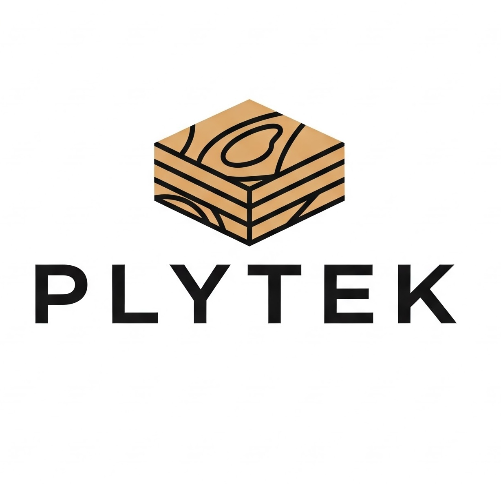

# PlyTek - Premium Plywood & Timber Solutions

🚀 **Revolutionizing Wood, One Layer at a Time**

PlyTek is a cutting-edge company specializing in high-quality, pest-resistant plywood and timberwood. This fully functional website showcases our products and services with modern design and excellent user experience.



## 🌟 Features

### Core Functionality
- **Responsive Design** - Optimized for desktop, tablet, and mobile devices
- **Interactive Gallery** - Showcase our products with modal image viewer
- **Contact Forms** - Professional contact and quote request forms
- **Mobile Navigation** - Smooth mobile menu with hamburger toggle
- **Smooth Scrolling** - Seamless navigation between sections
- **Loading Animation** - Professional loading screen on page load

### Business Features
- **Product Showcase** - Detailed information about plywood and timber products
- **Company Information** - About us, mission, and vision sections
- **Customer Testimonials** - Social proof from satisfied clients
- **Project Portfolio** - Featured projects and success stories
- **Contact Information** - Multiple contact methods and location map
- **Quote Request System** - Detailed quote form for potential customers

### Technical Features
- **SEO Optimized** - Meta tags, structured data, and semantic HTML
- **Performance Optimized** - Fast loading with optimized images
- **Cross-browser Compatible** - Works on all modern browsers
- **Accessibility** - Proper ARIA labels and keyboard navigation
- **Modern CSS** - CSS Grid, Flexbox, and custom properties
- **Vanilla JavaScript** - No external dependencies

## 🎨 Design Highlights

- **Professional Color Scheme** - Wood industry themed colors
- **Modern Typography** - Clean, readable font choices
- **Intuitive Navigation** - Easy to find information
- **Beautiful Animations** - Subtle fade-in effects and transitions
- **High-Quality Images** - Professional product photography
- **Clean Layout** - Well-organized content sections

## 📱 Sections

1. **Header** - Navigation and company logo
2. **Hero** - Main introduction with call-to-action
3. **About** - Company information and values
4. **Products** - Detailed product offerings
5. **Advantages** - Why choose PlyTek
6. **Gallery** - Product image showcase
7. **Projects** - Featured client projects
8. **Testimonials** - Customer reviews
9. **Target Market** - Who we serve
10. **Contact** - Contact form and information
11. **Footer** - Links and company details

## 🚀 Getting Started

### Prerequisites
- Any modern web browser (Chrome, Firefox, Safari, Edge)
- Optional: Local web server for testing

### Installation

1. **Clone or Download** the project files
2. **Open** `index.html` in your web browser
3. **Or run a local server:**

```bash
# Using Python 3
python3 -m http.server 8000

# Using Python 2
python -m SimpleHTTPServer 8000

# Using Node.js
npx serve .

# Using PHP
php -S localhost:8000
```

4. **Navigate** to `http://localhost:8000` in your browser

## 📁 File Structure

```
plytek-website/
├── index.html              # Main website file
├── README.md               # Documentation
├── plytek-logo.jpeg        # Company logo
├── plywood.png            # Product images
├── timber.png
├── customwood.png
├── factory.png
├── target-market.png
├── gallery-1.png          # Gallery images
├── gallery-2.png
├── gallery-3.png
├── gallery-4.png
├── gallery-5.png
└── gallery-6.png
```

## 🛠️ Customization

### Colors
The website uses CSS custom properties for easy color customization:

```css
:root {
    --plytek-primary: #2e5e39;    /* Primary green */
    --plytek-secondary: #8c6e41;  /* Secondary brown */
    --plytek-accent: #d9bc8c;     /* Accent cream */
    --plytek-dark: #333;          /* Text color */
    --plytek-light: #f8f5f0;      /* Background */
}
```

### Content
- Update company information in the HTML
- Replace images with your own products
- Modify contact details and location
- Customize testimonials and projects

### Functionality
- Contact forms include client-side validation
- Quote modal system for lead generation
- Gallery modal for product showcase
- Mobile-responsive design

## 📧 Contact Integration

The contact and quote forms are ready for backend integration. To connect to your email service:

1. **Backend Setup** - Create server endpoints for form handling
2. **Email Service** - Integrate with services like EmailJS, Formspree, or custom SMTP
3. **Database** - Store inquiries in your preferred database
4. **CRM Integration** - Connect to CRM systems for lead management

## 🌐 SEO Features

- **Meta Tags** - Title, description, keywords, and Open Graph
- **Semantic HTML** - Proper heading structure and landmarks
- **Alt Text** - All images include descriptive alt attributes
- **Schema Markup** - Ready for structured data implementation
- **Mobile-First** - Responsive design for mobile rankings

## 📊 Analytics Ready

The website is ready for analytics integration:
- Google Analytics
- Facebook Pixel
- Heat mapping tools
- A/B testing platforms

## 🔧 Browser Support

- Chrome (latest)
- Firefox (latest)
- Safari (latest)
- Edge (latest)
- Mobile browsers

## 📝 License

This website template is created for PlyTek. Modify and use according to your business needs.

## 🤝 Support

For questions about the website or PlyTek products:

- **Email:** plytek.info@gmail.com
- **Phone:** +91 9000989897
- **Address:** Door No: 40-1-15/A, MG Road, Near Benz Circle, Andhra Pradesh, India - 520010

---

**Built with ❤️ for PlyTek - Revolutionizing the Wood Industry**
